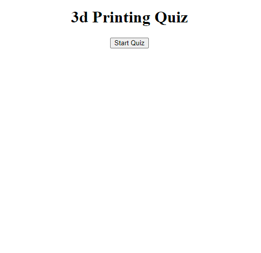
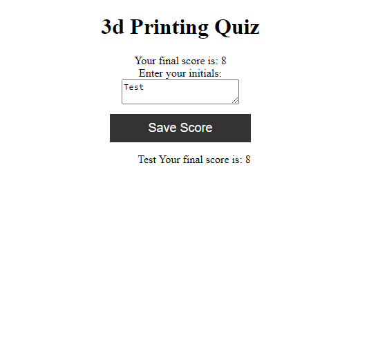

# <Quiz-game>

## Description

I built this application to provide a short test of 3D printer knowledge for whoever uses this.

## Installation

To begin the quiz click on the start button and answer by clicking the box with the answer in it. once at the end your score should be provided and enter your name or initials in to have you score saved

## Usage

Click the start button in the image above to start

Example of quiz in progress

End with test score saved

## License

Please refer to the license file provided

## Features
This is a quiz about 3D printing with scores saved in local storage.
